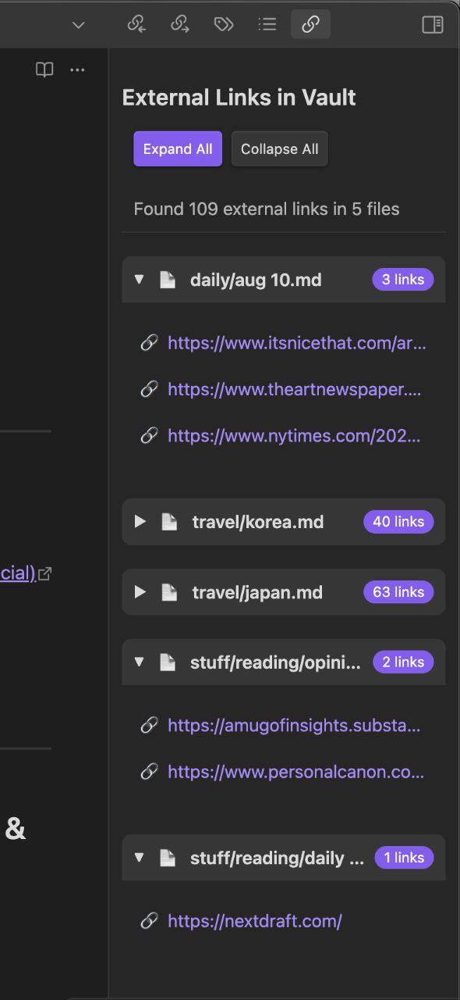

# External Links View

View all external links from your notes in one organized place, sorted by their source notes.

## Features

-   📋 Collects all external links from your vault in one view
-   🗂 Organizes links by their source notes, with collapsible sections per note
-   🔗 Clickable links that open in your default browser
-   ⚙️ Settings to exclude specific URLs or file paths
-   🎯 Quick access via ribbon icon or command palette

## How to Use

1. Install the plugin from Obsidian's Community Plugins
2. Click the chain link icon in the ribbon to open the External Links view
3. Alternatively, use the command palette and search for "Show External Links"

The plugin will show all external links found in your notes, organized by the note they appear in. Click any link to open it in your browser.

## Settings

-   **Exclude patterns**: Regex patterns to exclude certain URLs from appearing in the view. Enter one pattern per line.
-   **Exclude path regex**: A regex pattern to exclude entire file paths from being scanned (e.g. `^private/` to skip all notes in a `private` folder).

## Development

This plugin is built with TypeScript and uses the Obsidian API. To build from source:

1. Clone this repository
2. Run `npm install` to install dependencies
3. Run `npm run dev` to start compilation in watch mode
4. Copy built files to your Obsidian plugins folder

To release a new version, update `minAppVersion` in `manifest.json`, then run `npm version patch` (or `minor`/`major`). This bumps the version in `manifest.json` and `package.json` and adds an entry to `versions.json`.

## Manually installing the plugin

Copy `main.js`, `styles.css`, and `manifest.json` to your vault at `VaultFolder/.obsidian/plugins/external-links-view/`.
